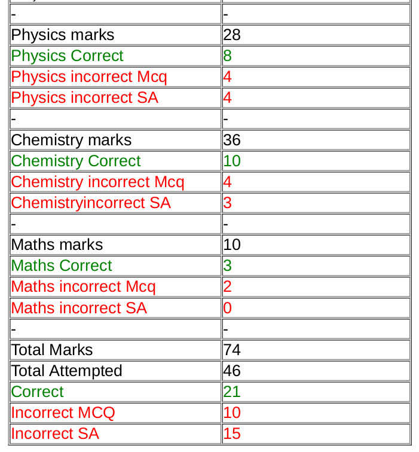
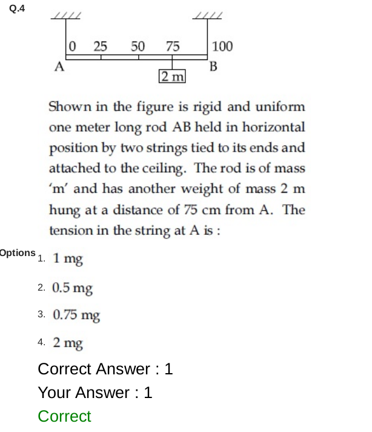

# Analyze-Jee-mains-answers
A chrome extension which will help you analyze your jee mains answers by comparing it with the given answer key.  
## What does the extension do?
1. It creates a summary of your subject wise and total scores.   
&nbsp;&nbsp;   
2. For each question it shows the correct answer.   
&nbsp;&nbsp;   

## How to use  
1. Clone the repo locally and add this unpacked extension to your chrome. [Tutorial](https://webkul.com/blog/how-to-install-the-unpacked-extension-in-chrome/)
2. Login into [Jee mains portal](https://testservices.nic.in/examsys/root/DownloadAdmitCard.aspx?enc=WPJ5WSCVWOMNiXoyyomJgCV8FnblijC/LgfnhSRLLM1NzZYph1GSqanSYz8mXgEt).  
3. Go to the answer key page, open the extension and click save answers. 
4. Go to your question paper page, open the extension and click Analyze answers.  
